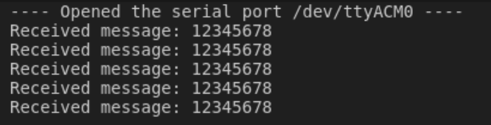
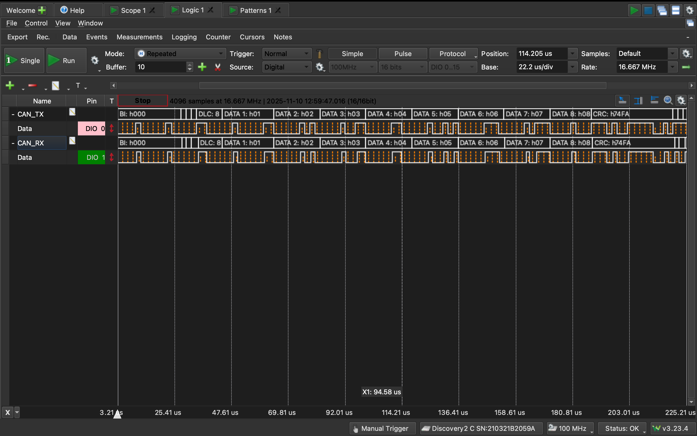
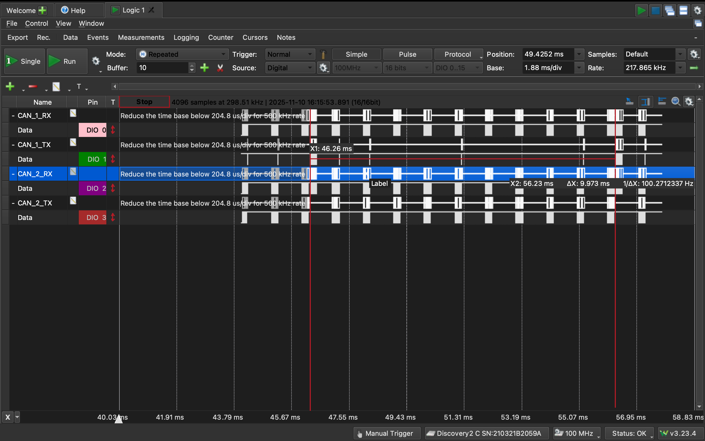

## Activity 1
#### A message sent by our transmitter and printed to serial monitor by our receiver

#### AD2 + Waveforms screenshot of transmitter TX and receiver RX signals

## Activity 2
The higher priority babbling node prevented the lower priority node from delivering its message at the expected frequency.

Adding a 1ms delay to the babbling node allowed us to consistently receive the lower priority node.

#### AD2 + Waveforms screenshot of RX and TX signals for low priority node + babbling node w/ 1ms delay

